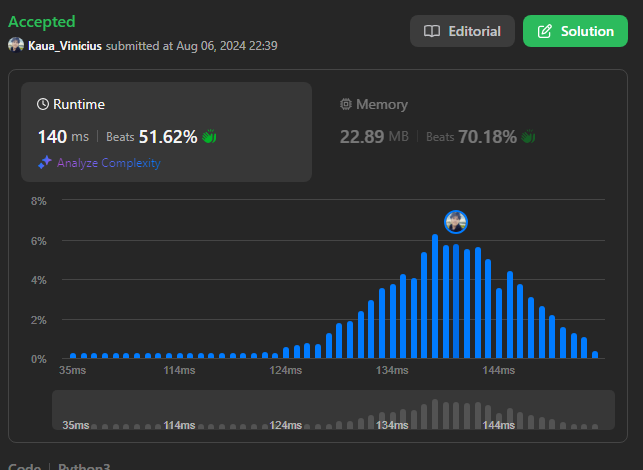

# D&C_JuizOnline

**Número da Lista**: 4<br>
**Conteúdo da Disciplina**: D&C<br>

## Alunos

|Matrícula | Aluno |
| -- | -- |
| 21/1029399  |  Kauã Vinícius |
| 18/0030736  |  Carla de Araújo|

## Sobre 
Este repositório tem como objetivo a realização de exercícios de D&C do site [leetcode](https://leetcode.com/), seguem os exercícios solucionados com seus respectivos vídeos:

1 - [Median of Two sorted arrays](https://leetcode.com/problems/median-of-two-sorted-arrays/): Hard. [Vídeo](https://youtu.be/NLcQMjQ1ACQ)
</br>
2 - [Search a 2D Matrix](https://leetcode.com/problems/search-a-2d-matrix-ii/): Medium [Vídeo](https://youtu.be/XPMrSFviYFE)
</br>
3 - [Merge k sorted lists](https://leetcode.com/problems/merge-k-sorted-lists/description/): Hard. [Vídeo](https://youtu.be/Hhs-d6XPiZI)
</br>
4 - [Sort list](https://leetcode.com/problems/sort-list/description/): Medium. [Vídeo](https://youtu.be/-umEm8GXtEw)

## Screenshots
As imagens 1 à 4 evidenciam as screenshots dos códigos que foram aceitos pelo site:

##### 1 - Median of Two sorted arrays 

<div style="text-align: center">
<p> Imagem 1: Código aceito primeiro exercício (Fonte: Autor, 2024).</p>
</div>

##### 2 - Search a 2D Matrix


<div style="text-align: center">
<p> Imagem 2: Código aceito segundo exercício (Fonte: Autor, 2024).</p>
</div>

##### 3 - Merge k sorted list


<div style="text-align: center">
<p> Imagem 3: Código aceito terceiro exercício (Fonte: Autor, 2024).</p>
</div>

##### 4 - Sort list


<div style="text-align: center">
<p> Imagem 4: Código aceito quarto exercício (Fonte: Autor, 2024).</p>
</div>

## Instalação 
**Linguagem**: C++ e Python<br>

Para os códigos python, execute:

```
python <nome do arquivo>
```

Para os códigos em c++, execute:

```
g++ -o <nomedoarquivo>.exe ./<nomedoarquivo>.cpp
